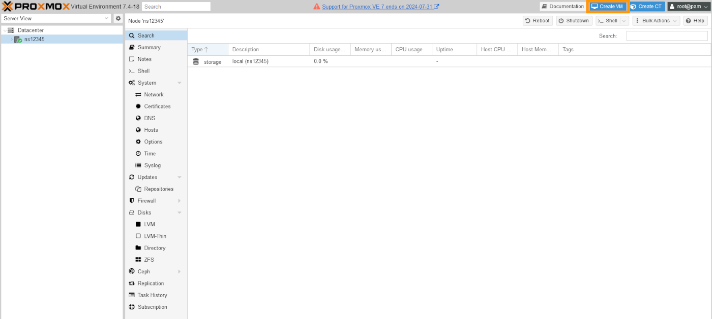
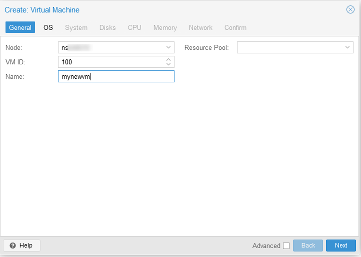
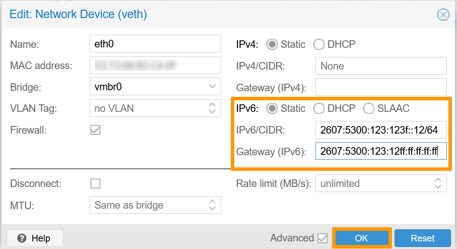
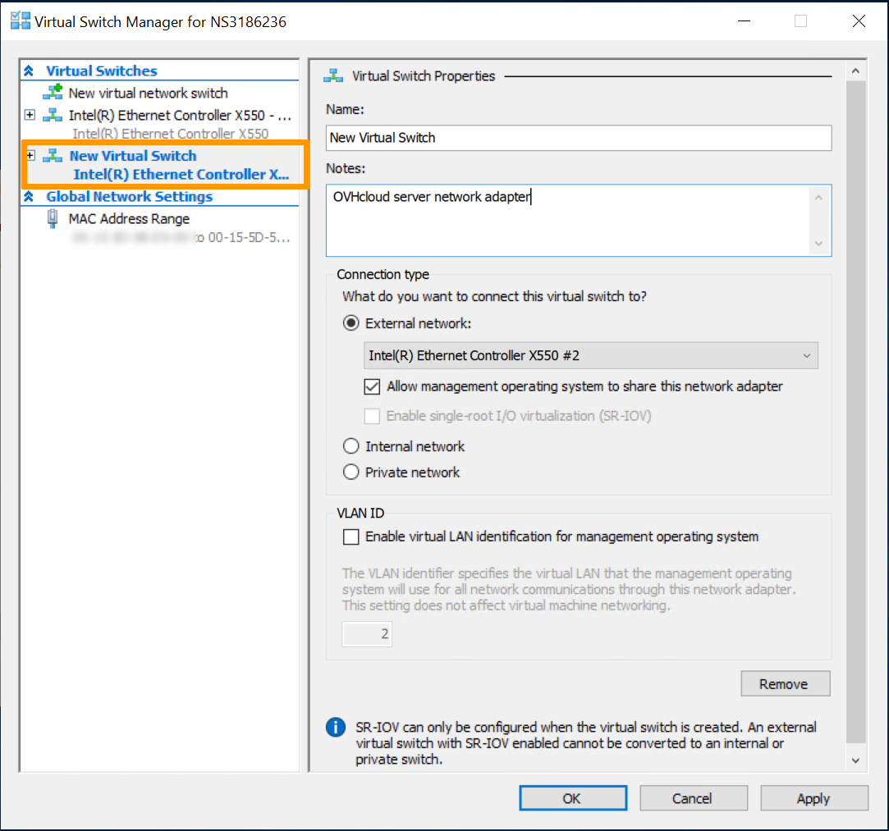

## Objectif

Internet Protocol version 6 (IPv6) est le successeur d'Internet Protocol version 4 (IPv4). Mis en place pour résoudre l’épuisement des adresses IPv4, IPv6 utilise des adresses de 128 bits au lieu d’adresses de 32 bits. Les serveurs des gammes High Grade, Scale et Advance (depuis juillet 2024) sont livrés avec un bloc /56 IPv6. Les anciens serveurs sont quant à eux livrés avec un bloc /64 IPv6. Un serveur livré avec un bloc /56 IPv6 permet de disposer de jusqu'à 18 quintillions d’adresses IP.

Notre infrastructure vous permet également de configurer l'IPv6 sur vos machines virtuelles.

**Ce guide vous explique comment configurer des adresses IPv6 sur votre machine virtuelle.**

> [!warning]
> OVHcloud met à votre disposition des services dont la responsabilité vous revient. En effet, n’ayant aucun accès à ces machines, nous n’en sommes pas les administrateurs et ne pourrons vous fournir d’assistance. Il vous appartient de ce fait d’en assurer la gestion logicielle et la sécurisation au quotidien.
>
> Nous mettons à votre disposition ce guide afin de vous accompagner au mieux sur des tâches courantes. Néanmoins, nous vous recommandons de faire appel à un [prestataire spécialisé](/links/partner) si vous éprouvez des difficultés ou des doutes concernant l’administration, l’utilisation ou la sécurisation d’un serveur. Plus d’informations dans la section « Aller plus loin » de ce guide.
>

## Prérequis

- Disposer d’un [serveur dédié](/links/bare-metal/bare-metal) disposant d'un bloc IPv6 (/64) ou (/56) dans votre compte OVHcloud.
- Avoir installé un système d'exploitation permettant la virtualisation (Proxmox, Hyper-V etc..).
- Avoir toutes les informations relatives à votre IPv6 (préfixe, passerelle...).
- Avoir des connaissances de base en SSH et en réseau.

> [!warning]
> Veuillez noter que nous ne proposons plus Vmware EXSi en tant que système d’exploitation. Par conséquent, les exemples de configuration de ce guide se concentreront sur Proxmox et Windows Hyper-V.

## En pratique

Les sections suivantes contiennent les configurations des distributions que nous proposons actuellement et les distributions/systèmes d’exploitation les plus couramment utilisés. La première étape consiste toujours à vous connecter à votre serveur en SSH ou via une session de connexion GUI (RDP pour un serveur Windows).

Sur les serveurs dédiés, la première IPv6 est déclarée comme 2607:5300:xxxx:xxxx::/64. Par exemple, si nous avons attribué à votre serveur la plage IPv6 : `2607:5300:xxxx:xxxx::/64`, la première IPv6 de votre serveur est : `2607:5300:xxxx:xxxx::/64`.

Avant de débuter, et afin d’utiliser les mêmes terminologies durant les manipulations, nous vous invitons à prendre connaissance du tableau ci-dessous. Il référence des termes que nous utiliserons dans cette documentation :

|Terme|Description|Exemple|
|---|---|---|
|YOUR_IPV6|Il s'agit d'une adresse IPv6 du bloc IPv6 attribué à votre serveur|2607:5300:xxxx:xxxx::1|
|IPv6_PREFIX|Il s'agit du préfixe (ou *netmask*) de votre bloc IPv6, généralement de /64 ou /56|2607:5300:xxxx:xxxx::/64|
|IPv6_GATEWAY|Il s'agit de la passerelle (ou *gateway*) de votre bloc IPv6|2607:5300:xxxx:ff:ff:ff:ff:ff ou fe80::1|

Dans nos exemples, nous utiliserons l'éditeur de texte `nano`. Vous pouvez bien entendu utiliser l'éditeur de texte de votre choix.

### Passerelle par défaut (Gateway)

La première étape consiste à récupérer la passerelle (gateway) IPv6 assignée à votre serveur. Deux méthodes sont possibles :

- Obtenir les informations réseau via l'espace client
- Obtenir les informations réseau via les API

#### Via votre espace client

Connectez-vous à votre [espace client OVHcloud](/links/manager), rendez-vous dans la section `Bare Metal Cloud`{.action} et sélectionnez votre serveur sous la partie `Serveur dédiés`{.action}.

La passerelle IPv6 assignée à votre serveur est affichée dans la section `Réseau` de l'onglet `Informations générales`{.action}.

{.thumbnail}

#### Via les API OVHcloud 

Une autre façon de récupérer les informations réseau de votre serveur est d'[utiliser l'API OVHcloud](/pages/manage_and_operate/api/first-steps).

Exécutez l'appel API suivant, en indiquant le nom interne du serveur (exemple : `ns3956771.ip-169-254-10.eu`) :

> [!api]
>
> @api {v1} /dedicated/server GET /dedicated/server/{serviceName}/specifications/network
>

Veuillez noter que les "0" de tête peuvent être supprimés dans une passerelle IPv6.

Exemple :

IPv6_GATEWAY : `2607:5300:60:62ff:00ff:00ff:00ff:00ff` peut aussi être écrit comme `2607:5300:60:62ff:ff:ff:ff:ff`.

### Préparer l'hôte

#### Proxmox

**Pour une machine virtuelle**

La première étape consiste à créer la machine virtuelle dans Proxmox.

Une fois connecté au tableau de bord Proxmox, cliquez sur le nom de votre serveur dans le coin à gauche, puis sur `Créer VM`{.action}.

{.thumbnail}

**Create: Virtual Machine**

> [!tabs]
> **General**
>>
>> **Name:** Renseignez un nom pour votre VM.
>>
>>{.thumbnail}
>> 
> **OS**
>> Cliquez sur la flèche déroulante à côté de `ISO image` pour sélectionner l'image de votre choix. Dans notre exemple, nous utilisons ubuntu 24.04 ISO.
>>
>>{.thumbnail}
>>
> **Confirm**
>>
>> Une fois votre sélection faite, cliquez sur `Finish`{.action} pour créer la VM.
>>
>>{.thumbnail}
>>

Une fois le système d'exploitation installé sur la machine virtuelle, vous pouvez procéder à la [configuration](#configurationsteps) de l'adresse IPv6.

**Pour un conteneur**

Une fois votre conteneur créé, cliquez dessus dans le menu de gauche. Cliquez ensuite sur `Réseau`{.action}.

{.thumbnail}

Sélectionnez le réseau existant et cliquez sur `edit`{.action}.

{.thumbnail}

Complétez les champs IPV6 avec les bonnes informations.

{.thumbnail}

Enfin, cliquez sur `OK`{.action} pour enregistrer les modifications.

Connectez-vous à votre conteneur pour vérifier la connectivité IPv6 avec la commande `ping` :

{.thumbnail}

#### Windows Server/Hyper-V

La première étape consiste à installer le rôle Hyper-V sur votre serveur Windows. Pour plus d'informations, consultez la [documentation officielle](https://learn.microsoft.com/en-us/windows-server/virtualization/hyper-v/get-started/install-the-hyper-v-role-on-windows-server){.external}.

Avant de configurer votre machine virtuelle, vous devez créer un commutateur virtuel.

Depuis la ligne de commande de votre serveur dédié, exécutez la commande suivante et notez le nom de la carte réseau qui contient l'adresse IP principale du serveur :

```powershell
ipconfig /all
```

Dans le panneau de configuration Hyper-V, créez un nouveau commutateur virtuel et définissez le type de connexion sur `Externe`{.action}.

Sélectionnez l'adaptateur avec l'adresse IP du serveur, puis cochez `Autoriser le système d'exploitation à partager cette carte réseau`{.action}.

{.thumbnail}

> [!primary]
> 
> Cette étape n'est requise qu'une seule fois pour un serveur Hyper-V. Pour toutes les machines virtuelles, un commutateur virtuel est nécessaire pour connecter les cartes réseau virtuelles de la machine virtuelle à la carte physique du serveur.
> 

Ensuite, allez dans les paramètres de la VM et cliquez sur `Network Adapter`{.action} dans l'onglet de gauche. Dans la liste déroulante, sélectionnez le commutateur virtuel créé ci-dessus et cliquez sur `Appliquer`{.action}, puis sur `OK`{.action}.

{.thumbnail}

Une fois le système d'exploitation installé sur la machine virtuelle, vous pouvez procéder à la [configuration](#configurationsteps) de l'adresse IPv6.

### Configurer l'IPv6 sur les machines virtuelles <a name="configurationsteps"></a>

#### Configuration basée sur Netplan

La configuration ci-dessous est basée sur Ubuntu 20.04.

Une fois connecté à votre machine virtuelle, la première étape consiste à accéder au fichier de configuration :

```bash
sudo nano /etc/netplan/50-cloud-init.yaml
```

Configurez ensuite l'adresse IPv6 de votre choix en remplaçant *YOUR_IPV6*, *IPV6_PREFIX* et *IPV6_GATEWAY* par vos propres valeurs.

```yaml
network:
    ethernets:
        ens18:
            dhcp4: true
            dhcp6: false
            addresses:
              - YOUR_IPV6/IPV6_PREFIX
            routes:
              - to: default
                via: IPV6_GATEWAY
                on-link: true
    version: 2
```

> [!warning]
>
> Il est important de respecter l'alignement de chaque élément dans les fichiers `yaml` comme représenté dans l'exemple ci-dessus. N'utilisez pas la touche de tabulation pour créer votre espacement. Seule la touche espace doit être utilisée.
>

Enregistrez vos modifications dans le fichier de configuration et quittez l'éditeur.

Appliquez la configuration :

```bash
netplan apply
```

Pour tester la connectivité de votre IPv6, exécutez la commande `ping` à l'adresse `2001:4860:4860::8888` :

{.thumbnail}

#### Configuration basée sur network interfaces

La configuration ci-dessous est basée sur Debian 11.

Une fois connecté à votre machine virtuelle, la première étape consiste à accéder au fichier de configuration :

```bash
sudo nano /etc/network/interfaces
```

Configurez ensuite l'adresse IPv6 de votre choix en remplaçant *YOUR_IPV6*, *IPV6_PREFIX* et *IPV6_GATEWAY* par vos propres valeurs. Remplacez `ens18` par le nom de votre interface.

```console
auto lo
iface lo inet loopback

auto ens18
iface ens18 inet6 static
address YOUR_IPV6/IPV6_PREFIX
gateway IPV6_GATEWAY
```

Enregistrez vos modifications dans le fichier de configuration et quittez l'éditeur.

Ensuite, redémarrez le réseau avec la commande suivante :

```bash
sudo systemctl restart networking.service
```

Pour tester la connectivité de votre IPv6, exécutez la commande `ping` à l'adresse `2001:4860:4860::8888` :

{.thumbnail}


#### Configuration basée sur NetworkManager

La configuration ci-dessous est basée sur Fedora 40.

Fedora ainsi que les dernières versions d'Almalinux et de Rocky Linux utilisent maintenant des fichiers clés. NetworkManager a précédemment stocké des profils réseau au format ifcfg dans ce répertoire : `/etc/sysconfig/network-scripts/`. Cependant, le format ifcfg est désormais déconseillé. Par défaut, NetworkManager ne crée plus de profils dans ce format. Le fichier de configuration se trouve maintenant dans `/etc/NetworkManager/system-connections/`.

Une fois connecté à votre machine virtuelle, la première étape consiste à accéder au fichier de configuration :

```bash
sudo /etc/NetworkManager/system-connections
```

Utilisez la commande `ls` pour afficher le fichier de configuration réseau. Dans notre exemple, notre fichier s'appelle `ens18.nmconnection`.

{.thumbnail}

Configurez ensuite l'adresse IPv6 de votre choix en remplaçant *YOUR_IPV6*, *IPV6_PREFIX* et *IPV6_GATEWAY* par vos propres valeurs.

```bash
sudo nano /etc/NetworkManager/system-connections/ens18.nmconnection
```

```console
[ipv6]
method=manual # si la valeur est "auto", remplacez par "manual".
may-fail=true
address=YOUR_IPV6/IPv6_PREFIX
gateway=2607:5300:xxxx:xxff:ff:ff:ff:ff
```

Enregistrez vos modifications dans le fichier de configuration et quittez l'éditeur.

Ensuite, redémarrez le réseau avec la commande suivante :

```bash
sudo systemctl restart NetworkManager
```

Pour tester la connectivité de votre IPv6, exécutez la commande `ping` à l'adresse `2001:4860:4860::8888` :

{.thumbnail}

## Aller plus loin

Échangez avec notre [communauté d'utilisateurs](/links/community).
