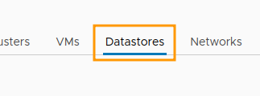

## Objectif

**Découvrez comment téléverser des fichiers dans un dossier de votre banque de données depuis le client HTML VMware vSphere on OVHcloud.**

## Prérequis

- Être connecté à [l'espace client OVHcloud](/links/manager).
- Être administrateur technique de l'infrastructure [VMware on OVHcloud](/links/hosted-private-cloud/vmware).
- Si vous utilisez IAM, vérifiez bien que vous disposez des droits, rôles et actions nécessaires pour téléverser des fichiers ou créer des répertoires dans le datastore. Pour plus d'informations, consultez le guide « [IAM pour VMware on OVHcloud - Présentation et FAQ](/pages/hosted_private_cloud/hosted_private_cloud_powered_by_vmware/vmware_iam_getting_started) ».

## En pratique

> [!primary]
> 
> Ce guide remplace la méthode SFTP, devenue obsolète : [Se connecter en SFTP](/pages/hosted_private_cloud/hosted_private_cloud_powered_by_vmware/sftp_connexion).
>

### Étape 1 - Accéder au datastore

Connectez-vous à l'interface web vSphere, en vous aidant si besoin du guide « [Se connecter à la console Web vSphere on OVHcloud](/pages/hosted_private_cloud/hosted_private_cloud_powered_by_vmware/vsphere_interface_connexion) ».

Vous devez ensuite accéder aux repertoires sur lequel vous voulez stocker vos fichiers (ISO par exemple). L'objectif étant de créer une arborescence afin de retrouver facilement vos éléments au sein de votre vSphere managé.

{.thumbnail}

### Étape 2 - Téléverser des fichiers

Vous disposez de 2 façons d'y accéder, libre à vous de choisir celle qui vous convient le mieux :

**1\. Depuis le menu `Inventaire`{.action} :**

|                                        **Images**                                         | **Étapes**                                                                       |
|:-----------------------------------------------------------------------------------------:|:---------------------------------------------------------------------------------|
| {.thumbnail}      | - Cliquez sur `Inventaire`{.action}.                                         |
| {.thumbnail}  {.thumbnail}| - Depuis `pcc-XXX-XXX-XXX-XXX.ovh.XX`, cliquez sur `Banques de données`{.action}. |

Vous retrouvez alors l'ensemble de vos banques de données (datastores) listées.

Cliquez sur votre banque de données pour voir apparaitre une section `Fichiers`{.action} dans laquelle s'ouvre votre fenêtre automatiquement.

{.thumbnail}

Depuis la section `Fichiers`{.action} de votre banque de données ouverte, cliquez sur `TÉLÉCHARGER DES FICHIERS`{.action}

Localisez l'élément à téléverser depuis votre ordinateur local (un fichier `XXX.iso` par exemple) et cliquez sur `Ouvrir`{.action} pour téléverser le fichier (ISO ou autre) depuis votre machine connectée au client HTML vSphere.

Le téléversement du fichier ISO commence automatiquement sans validation dans le dossier (s'il y en a un) de votre banque de données sélectionnée.

Vous pouvez actualiser l'explorateur de fichiers de la banque de données pour afficher le fichier téléversé dans la liste.

{.thumbnail}

Vous pouvez ainsi lancer ce fichier ISO depuis un périphérique CD/DVD au sein de vote VM et lancer l'installation de l'OS en suivant le processus d'installation. Il est cependant recommandé d'utiliser des modèles de déploiement OVHcloud ou des clones de VM transformés en modèles (*templates*) par vos soins.

**2\. Depuis le menu `Listes d'inventaires globaux`{.action} :**

Ce menu vous renvoie également à l'interface `Fichers`{.action} de téléversement :

|                                        **Images**                                         | **Étapes**                                                |
|:-----------------------------------------------------------------------------------------:|:----------------------------------------------------------|
| {.thumbnail}      | - Cliquez sur `Listes d'inventaires globaux`{.action}. |
| {.thumbnail} | - Puis sur `Banques de données`{.action}.                  |

{.thumbnail}

Cliquez sur le `Datastore` souhaité.

Vous allez vous retrouver dans la section `Fichiers`{.action} ou vous pourrez téléverser des données dans votre banque de données.

Cliquez ensuite sur `TELECHARGER DES FICHIERS`{.action} pour sélectionner le fichier (ISO ou autre) à téléverser depuis votre machine locale.

Localisez l'élément à téléverser depuis votre ordinateur local (un fichier `XXX.iso` par exemple) et cliquez sur `Ouvrir`{.action}

### Étape 3 - Téléverser des dossiers

Depuis votre banque de données, dans la section `Fichiers`{.action}, cliquez sur `TÉLÉCHARGER UN DOSSIER`{.action}.

Localisez l'élément à téléverser depuis votre machine connectée au client HTML vSphere et cliquez sur `Ouvrir`{.action}

Le téléversement ne commencera qu'après la confirmation validée : 

|                                       **Images**                                       | **Étapes**                                       |
|:--------------------------------------------------------------------------------------:|:-------------------------------------------------|
|        {.thumbnail}        | - Pour confirmer, cliquez sur `Envoyer`{.action}. |

### Étape 4 - Déplacer/Copier des fichiers

Depuis votre banque de données, cliquez sur `DÉPLACER VERS`{.action} ou `COPIER DANS`{.action}.

{.thumbnail}

Localisez l'élément de destination à déplacer depuis la banque de données et cliquez sur `OK`{.action}.

{.thumbnail}

Vous devez disposer des droits suffisants pour effectuer ce type d'actions.

### Étape 5 - Renommer des fichiers

Depuis votre banque de données, cliquez sur `Remplacer le nom par`{.action}.

{.thumbnail}

Renommez votre fichier puis cliquez sur `OK`{.action}.

### Étape 6 - Créer un dossier (facultatif)

Depuis la section `Fichiers`{.action} de votre banque de données, cliquez sur `NOUVEAU DOSSIER`{.action} pour créer un dossier où stocker vos fichiers.

Nommez votre dossier et cliquez sur `OK`{.action}.

{.thumbnail}

## Aller plus loin

- [IAM pour VMware on OVHcloud - Présentation et FAQ](/pages/hosted_private_cloud/hosted_private_cloud_powered_by_vmware/vmware_iam_getting_started)

Si vous avez besoin d'une formation ou d'une assistance technique pour la mise en œuvre de nos solutions, contactez votre Technical Account Manager ou rendez-vous sur [cette page](/links/professional-services) pour obtenir un devis et demander une analyse personnalisée de votre projet à nos experts de l’équipe Professional Services.

Posez des questions, donnez votre avis et interagissez directement avec l’équipe qui construit nos services Hosted Private Cloud sur le [channel Discord dédié](https://discord.gg/ovhcloud).

Échangez avec notre [communauté d'utilisateurs OVHcloud](/links/community).
